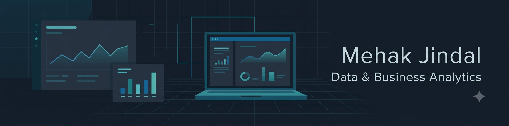

# Hi, I'm Mehak Jindal 👋

---

### 👩‍💻 About Me

I'm a third-year **Economics major with a Computer Science minor**, which gives me a bit of an unusual mix — I understand *why* numbers matter (from Economics) and I'm learning *how* to work with them at scale (from CS and my analytics training).

I'm currently building my skills in **Data & Business Analytics**, learning how to turn raw data into insights that actually help people make decisions. I'm not a software engineer and I don't do competitive programming — my focus is on using data to answer real business and economic questions.

---

### 📚 Currently Learning

- 🐍 Python
- 🗃️ SQL
- 📊 Power BI
- 📈 Excel
- 📐 Statistics
- 🤖 Machine Learning Fundamentals

---

### 🛠️ Tools & Tech

**Data Analysis:** Python · SQL · Excel  
**Visualization:** Power BI · Canva  
**Programming Foundations:** C++  
**Statistics & ML:** Statistics · Machine Learning  
**Productivity:** MS Office

---

### 📁 Projects / Case Studies

> 🚧 I'm currently working on my first case studies as part of my analytics training — this section will be updated soon with real projects (business problem → approach → tools used).
>
> Check back soon, or [connect with me on LinkedIn](https://www.linkedin.com/in/mehak-jindal-54033331a) to hear about what I'm working on!

---

### 📊 GitHub Stats

---

### 🎯 Open To

Internships and entry-level roles as a **Data Analyst / Business Analyst** — happy to connect if you're hiring or know of opportunities!

---

### 📫 Connect With Me

<i>Thanks for stopping by — always open to a good data conversation! 📊</i>

